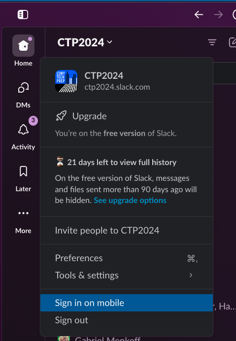

# WELLLLCOME

## Agenda
0. Remind me to start recording. 
0. Hello! And welcome to CTP!
0. How to succeed and what to expect 
* [Full slide deck](https://docs.google.com/presentation/d/1r42xs-9frnaFf4dEKBuQi5iAsZphqYco2oKR8bzoyLg/edit#slide=id.p)
* [TLDR slide deck](https://docs.google.com/presentation/d/1cgkgEVO8ZY4P49R45uu2BuLGsZ7_sfBqwu60eyJ8k9c/edit#slide=id.g2f65cf05428_0_0)
0. Getting started with jupyter notebook.
0. Live coding pandas --> Lecture.ipynb
0. Break
0. Explain breakout room rules. 
0. [Setting up github.]() <-- EDIT LINK 
	* Once a fellow is able to: 
	* Push to their fork. 
	* Put the link in the HW Submssion sheet. 
	* Then, they go to a breakout room. 
0. Exercise in breakout rooms.
0. When there is 15min left in class.
	* Close all breakout rooms and explain HW instructions and how to submit HW. 
0. Repeat HW Process and exactly what is due when. 
0. MUST FILL OUT BEFORE LEAVING CLASS [Weekly feedback form](https://forms.gle/VnNrD7BokpUicFhv6).

# Homework Due Monday [~2.5hrs to complete]
**Tuesdays class:  HW is due 12:01pm on Mondays**
How do you submit your HW?  
[Tuesday's HW Submission Sheet](https://docs.google.com/spreadsheets/d/150MVMGhClrJ7NFAoukEvbZoujM3a_-7v9r9q4QihiAc/edit?gid=0#gid=0).
Super details are below on how to submit the assignments.

## Pre-Class Videos [~1hr]
**Submit by pasting the link to your message under the "Pre-Class Slack Link" column.** 

0. [Watch "Top 25 Pandas Tricks"](https://youtu.be/RlIiVeig3hc?si=uowsrNJEI-bBHHU2) [~30min]
* Here are the [data files](https://github.com/justmarkham/pandas-videos/tree/master/data) for that video if you want to follow along.
2. Watch This Video: ["Best Places to Find Datasets for your Projects"](https://www.youtube.com/watch?v=PExdWWcxmro)

Respond in-thread in the class slack channel with at __least one thing you learned__ from the videos/reading/or tutorial.  

It can be as short as one sentence, or as long as a book. 

## Exercise [~1hr] 
**Submit Exercise HW by pasting the link in the HW Submission sheet under the "Exercise.ipynb" column.**

0. Make a copy of the exercise file (see instructions above).
0. Complete all the questions in YOUR COPY of the exercise file.
0. Push that file to your fork. 
0. Copy that exact link, and paste it into the HW submission sheet. 

## LinkedIn Post [~10min]
__Submit by putting the link to your LI post under the "LinkedIn Post" column.__

This week, your post can be about anything related to CTP or what your learned in class. Here are just some things you can post about (but not limited to)...
* It can be about starting your CTP journey. 
* Asking for advice on most important things to learn for entry level roles. 
* Something you leanred in the pre-class videos. 
* Why you love or hate pandas. 
* Your favorite part about the class. 
* A tip or trick that your learned in class. 
* Anything related to data science or your journey. 

 

## Update Slack Profile and install on phone
1. Put your picture in your Slack Profile.
1. Put your full name and preferred email
1. Install slack on your phone.  
Submit by putting any emoji under the "Slack Profile/Phone" column.

 
 

# Lecture
_Since we are setting up our github after lecture, you will not have the lecture files locally.  If you would like to code along, you can make a copy of this [Google Colab Notebook](https://colab.research.google.com/drive/1rujHx0nTq9HpkU50Lwyz2KI6uRzFIa0z?usp=sharing)._

## Getting started with notebooks. 

__Launching a juputer notebook.__

0. Open your terminal, navigate to whatever folder you want to work from. Then type into the terminal
0. `jupyter notebook` 
0. A browser window should pop up and you are now ready to ride.
0. _(extra credit, next class show class how to update their .bash_profile so they only have to type in 'jn' to launch jupyter notebook)_ 
0.  __If above does not work, follow instructions below__ 
	* First install jupyter notebook by running the following command
		* `pip install jupyter notebook`  
	* If that does not work, [follow instructions here](https://jupyterlab.readthedocs.io/en/stable/getting_started/installation.html)
	* If it still doesn't work, try using jupyter labs instead. 
		* `pip install jupyterlab`
	* If none of the above works, follow the setup instructions in the Setup folder in the main repo.
	* If it still does not work, ask for help in slack channel, or come to office hours. 

# Homework Instructions
__All HWs are due at 12:01pm (noon) the day before the next class__

Tue class:  HW due 12:01pm on Mon
Wed class: HW due 12:01pm on Tue
Fridays (both):  HW due 12:01pm on Thr

## There are 3 sections of HW every week.

### #1 Pre-Class HW [~less than 1hr]
This covers the topic we are about to teach.  This is HW that will help you come to class better prepared to learn the material that week. 
* Watch / read / do the tutorial listed above. 
* Go to your class slack channel.  
* Find the usually most recent message from your TA instructor that says "Week X: Pre-Class learnings". 
* Respond in-thread to that message with least one thing you learned from the videos/reading/or tutorial. 
	* Your response can be It can be as short as one sentence, or as long as a book. 
* Still in Slack, copy the link to your response. 
* Pasted that to your response in HW Submission sheets Pre-Class column for that week.

### #2 Exercise HW [~1hr]
This is a coding assignment that you usually start in class.  It is located in the `Exercise-DONT-EDIT-MAKE-COPY.ipynb` file.  See detaild instructions below. (Paste link in HW Submission sheet.)

### #3 LinkedIn Post
Every week you are expected to post on LinkeIn at least about thing you learned that week. (Paste link in HW Submission sheet.)

# Instructions on Doing, Uploading/Pushing, and Submitting your HW
**Tuesdays class:  HW is due 12:01pm on Mondays**
You have 6 days to complete your HW. 
HW is always due 1 day before class at 12:01pm (Noon).

Submit HW in the [Tuesday's HW Submission Sheet](https://docs.google.com/spreadsheets/d/150MVMGhClrJ7NFAoukEvbZoujM3a_-7v9r9q4QihiAc/edit?gid=0#gid=0).

Detailed instructions on how to complete each of the assignments below.

0. Make a copy of `Exercise-DONT-EDIT-MAKE-COPY.ipynb`
0. Name the new copy as `Exercise-[YOUR-INITIALS].ipynb`. Zack DeSario's would be `Exercise-ZD.ipynb`.

#### Doing your HW. 
0. Highly suggest spening your repo directory folder/file in VS Code.  You can easily run ipython notebooks in there, and even have git intergration. 

0. If you are not using VS Code then... Open your termial, type into your terminal and run
	* `jupyter notebook`
	* If that doesn't work, run `jupyter lab`

0. This should have launched a web page.  In that page, navigate to Week-01/Exercise-[YOUR-INITIALS].ipynb notebook.

0. In the first cell print your name
	* `print('[SOMETHING NICE ABOUT YOUR TA]')`

0. Save the file by clicking the disk icon in the top right or `Command+s`. Or clicking the floppy-disk icon in the top right. 

## Uploading/Pushing Your HW
*Adding your changes and pushing them to github so they are viewable the internet*

0. In your terminal that is in repo where you just edited the Exercise file....
0. Add your changes 
	* `git add Week-01-Pandas/Exercise-[YOUR-INITIALS].ipynb`
0. Commit your changes
	* `git commit -m 'YOUR COMMIT MESSAGE HERE'`
0. Push your changes
	* `git push`

#### Sanity check
0. Go to YOUR FORKED github repo. 
0. Navigate to Week-01 and click on the Exercise-[YOUR-INITIALS].ipynb file.
0. YOU SHOULD SEE YOUR `print('[SOMETHING NICE ABOUT YOUR TA]')` edits.
0. Make sure you can see the changes you made. 

## Submitting Your HW
0. Copy that exact URL, it should look something like this. https://github.com/zd123/my-fork-2023-fall-data-science-fridays/blob/main/Week-01-Pandas/Exercise-ZD.ipynb
0. Paste that URL next to your name in the HW Submission Sheet. 
	* [Tuesday's HW Submission Sheet](https://docs.google.com/spreadsheets/d/150MVMGhClrJ7NFAoukEvbZoujM3a_-7v9r9q4QihiAc/edit?gid=0#gid=0)

# Extra Stuff 
#### Extra pandas help / resources
* [Learn pandas with Hernan Rojas](https://bitbucket.org/hrojas/learn-pandas/src/master/)
* [Pandas Workshop](https://github.com/stefmolin/pandas-workshop/tree/main/notebooks)
* [Pandas Cookbook](https://github.com/jvns/pandas-cookbook/tree/master/cookbook)

